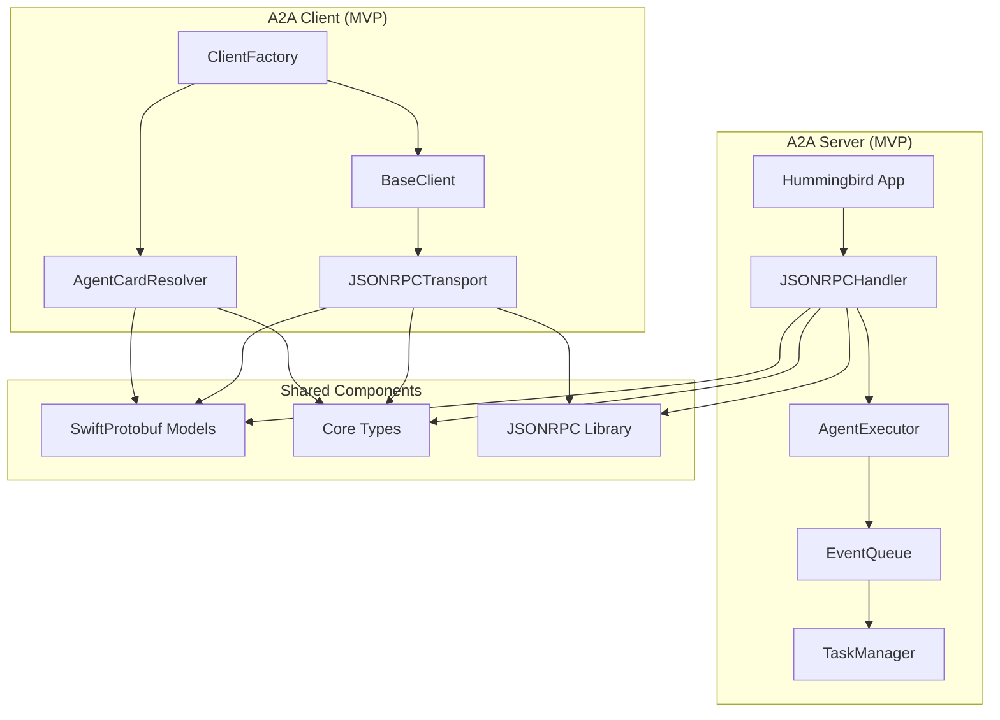

# A2A Swift SDK (MVP)

A Swift implementation of the Agent2Agent (A2A) Protocol SDK, focusing on minimum required features to get a working implementation.

## Overview

This is an **MVP Swift SDK** for the Agent2Agent (A2A) Protocol, using the [a2a-python](../a2a-python/) SDK as a reference implementation. The focus is on **minimum required features** to get a working implementation, leveraging modern Swift features and established Swift ecosystem packages.

**Package Name**: `a2a-swift`  
**Platforms**: macOS & Linux  
**Package Manager**: Swift Package Manager (SPM) only

## Architecture Overview



## Package Structure (MVP)

```
a2a-swift/
├── Package.swift
├── Sources/
│   ├── A2A/
│   │   ├── Core/
│   │   │   ├── Types.swift              # Core data models (Task, Message, AgentCard, etc.)
│   │   │   ├── Errors.swift             # Error types (minimum required)
│   │   │   └── Constants.swift          # Protocol constants
│   │   ├── Client/
│   │   │   ├── Client.swift             # Base client protocol and implementation
│   │   │   ├── ClientFactory.swift      # Client factory (JSON-RPC only for MVP)
│   │   │   ├── ClientConfig.swift       # Client configuration
│   │   │   ├── ClientTaskManager.swift  # Task state tracking
│   │   │   ├── CardResolver.swift       # Agent card discovery (no signature verification in MVP)
│   │   │   └── Transports/
│   │   │       ├── Transport.swift      # Transport protocol
│   │   │       └── JSONRPCTransport.swift
│   │   ├── Server/
│   │   │   ├── AgentExecution/
│   │   │   │   ├── AgentExecutor.swift  # Protocol for agent implementations
│   │   │   │   └── RequestContext.swift
│   │   │   ├── Tasks/
│   │   │   │   ├── TaskManager.swift
│   │   │   │   ├── TaskStore.swift
│   │   │   │   └── InMemoryTaskStore.swift
│   │   │   ├── Events/
│   │   │   │   └── EventQueue.swift
│   │   │   ├── RequestHandlers/
│   │   │   │   ├── RequestHandler.swift
│   │   │   │   ├── DefaultRequestHandler.swift
│   │   │   │   └── JSONRPCHandler.swift
│   │   │   └── Apps/
│   │   │       └── HummingbirdApp.swift
│   │   ├── Utils/
│   │   │   └── [Minimal utility functions]
│   │   └── Protobuf/
│   │       └── [Generated files from swift-protobuf]
│   └── Tests/
│       ├── ClientTests/
│       ├── ServerTests/
│       └── IntegrationTests/
```

## Dependencies

### Required Dependencies (MVP)

- **swift-protobuf**: Protocol Buffer code generation and runtime
- **Hummingbird**: HTTP server framework for A2A server
- **AsyncHTTPClient**: HTTP client for A2A client
- **SSEKit** ([orlandos-nl/SSEKit](https://github.com/orlandos-nl/SSEKit)): Server-Sent Events support
- **JSONRPC** ([ChimeHQ/JSONRPC](https://github.com/ChimeHQ/JSONRPC)): JSON-RPC 2.0 protocol support

### Deferred (Not in MVP)

- **grpc-swift**: gRPC support (deferred, JSON-RPC only for MVP)
- **swift-otel**: OpenTelemetry integration (deferred)
- Database persistence (in-memory only for MVP)
- Authentication middleware implementation (design only, not implemented)
- Agent card signature verification (deferred)
- Push notifications (deferred)
- Protocol extensions (deferred)

## Implementation Phases

### Phase 1: Foundation & Protocol Buffer Generation

**1.1 Setup Package Structure**

- Create `Package.swift` with package name `a2a-swift`
- Add dependencies:
  - `swift-protobuf` for Protocol Buffer support
  - `Hummingbird` for server HTTP framework
  - `AsyncHTTPClient` for client HTTP operations
  - `SSEKit` for Server-Sent Events
  - `JSONRPC` from ChimeHQ for JSON-RPC 2.0
- Configure for macOS & Linux platforms

**1.2 Protocol Buffer Code Generation**

- Create `buf.gen.yaml` or `protoc` configuration to generate Swift code from [A2A/specification/grpc/a2a.proto](../A2A/specification/grpc/a2a.proto)
- Use `protoc-gen-swift` plugin (from [swift-protobuf](https://github.com/apple/swift-protobuf))
- Generate Swift structs for all proto messages (Task, Message, AgentCard, etc.)
- Place generated files in `Sources/A2A/Protobuf/`

**1.3 Core Type Wrappers**

- Create Swift-friendly wrappers around generated protobuf types
- Implement `Codable` conformance for JSON-RPC serialization
- Create type-safe enums for TaskState, Role, etc.
- Location: `Sources/A2A/Core/Types.swift`

### Phase 2: Core Data Models & Utilities

**2.1 Core Types Implementation**

- Implement `Task`, `Message`, `AgentCard`, `Part`, `Artifact` as Swift structs/classes
- Use SwiftProtobuf generated types as backing storage
- Provide Swift-native APIs with proper type safety

**2.2 Error Types (Minimum Required)**

- Define A2A-specific error types conforming to `Error` protocol
- Map essential protocol errors:
  - `TaskNotFoundError`
  - `InvalidParamsError`
  - `InternalError`
  - `ContentTypeNotSupportedError`

**2.3 Utility Functions (Minimal)**

- Basic Message/Artifact/Task manipulation helpers
- JSON-RPC request/response builders using ChimeHQ JSONRPC library

### Phase 3: Server Implementation (MVP)

**3.1 Event Queue (Actor-based)**

- Implement `EventQueue` as a Swift `Actor` for thread-safe event management
- Use `AsyncStream` with `Continuation` for event consumption
- Support child queue "tapping" for streaming scenarios
- Use Swift standard library `Mutex` (SE-0433) where synchronous locking is needed

**3.2 Task Management (In-Memory Only)**

- Implement `TaskManager` for task lifecycle management
- Create `TaskStore` protocol with `InMemoryTaskStore` implementation only
- No database persistence in MVP

**3.3 Agent Executor Protocol**

- Define `AgentExecutor` protocol (similar to Python's abstract base class)
- Implement `execute(context:eventQueue:) async throws` method
- Implement `cancel(context:eventQueue:) async throws` method

**3.4 Request Handlers**

- Implement `RequestHandler` protocol
- Create `DefaultRequestHandler` that orchestrates agent execution
- Implement `JSONRPCHandler` using ChimeHQ JSONRPC library
- Support both blocking (`message/send`) and streaming (`message/stream`) responses

**3.5 Hummingbird Integration with SSEKit**

- Create `A2AHummingbirdApplication` that wraps Hummingbird server
- Add routes for:
  - `POST /message:send` (JSON-RPC endpoint)
  - `POST /message:stream` (SSE streaming endpoint using SSEKit)
  - `GET /.well-known/agent-card.json` (Agent card endpoint)
- Implement Server-Sent Events (SSE) streaming using [SSEKit](https://github.com/orlandos-nl/SSEKit)

### Phase 4: Client Implementation (MVP)

**4.1 Transport Layer (JSON-RPC Only)**

- Define `ClientTransport` protocol
- Implement `JSONRPCTransport` using AsyncHTTPClient
- Support SSE streaming for `send_message_streaming` using SSEKit
- Defer REST and gRPC transports

**4.2 Client Core**

- Implement `BaseClient` class with transport-independent logic
- Implement `Client` protocol
- Support async iteration over streaming responses using `AsyncSequence`

**4.3 Client Factory (JSON-RPC Only)**

- Implement `ClientFactory` for creating clients from AgentCards
- Support JSON-RPC transport only (no transport negotiation in MVP)

**4.4 Agent Card Resolution (Basic)**

- Implement `AgentCardResolver` for discovering agent cards
- Support well-known path (`/.well-known/agent-card.json`)
- Defer signature verification

**4.5 Client Task Manager**

- Implement `ClientTaskManager` for tracking task state on client side
- Aggregate streaming updates into complete task state

**4.6 Middleware/Interceptors (Design Only)**

- Define `ClientCallInterceptor` protocol for future use
- **Not implemented in MVP** - design included for extensibility

## Key Swift-Specific Design Decisions

### Structured Concurrency

- Use `async/await` throughout (no callback-based APIs)
- Use `AsyncSequence` for streaming responses
- Use `TaskGroup` for concurrent operations
- Use `actor` for thread-safe state management (EventQueue, TaskStore)

### Synchronization

- Use Swift standard library `Mutex` (SE-0433) for synchronous locking where needed
- Use `actor` for async-safe state management
- Reference: [SE-0433 Mutex Proposal](https://github.com/swiftlang/swift-evolution/blob/main/proposals/0433-mutex.md)

### Error Handling

- Use Swift's `Result` type where appropriate
- Define custom error types conforming to `Error`
- Use `throws` for synchronous errors, `async throws` for async operations

### Type Safety

- Leverage Swift's strong typing and generics
- Use enums with associated values for discriminated unions (e.g., `Part`)
- Use protocols for extensibility (AgentExecutor, Transport, TaskStore)

### Memory Management

- Use value types (structs) where possible for immutability
- Use reference types (classes) only when necessary (shared state, inheritance)
- Leverage ARC for automatic memory management

## MVP Scope - What's Included

✅ **Included:**

- JSON-RPC transport only (client and server)
- Server-Sent Events (SSE) streaming using SSEKit
- In-memory task storage
- Basic agent card discovery (no signature verification)
- Core A2A operations: `message/send`, `message/stream`, `tasks/get`
- Agent executor protocol for custom agent implementations
- Basic error handling

❌ **Deferred (Not in MVP):**

- gRPC transport
- REST/HTTP+JSON transport
- Database persistence
- Push notifications
- Protocol extensions
- Agent card signature verification
- Authentication middleware implementation
- OpenTelemetry integration
- Extended agent card support
- Task cancellation (design only, minimal implementation)

## Testing Strategy (MVP)

- Unit tests for core components (Types, EventQueue, TaskManager)
- Basic integration tests for client-server interactions
- Mock implementations for testing (MockTransport, MockAgentExecutor)
- Test fixtures using sample AgentCards and messages

## References

- **Swift Protobuf**: [apple/swift-protobuf](https://github.com/apple/swift-protobuf)
- **Hummingbird**: [hummingbird-project/hummingbird](https://github.com/hummingbird-project/hummingbird)
- **AsyncHTTPClient**: [swift-server/async-http-client](https://github.com/swift-server/async-http-client)
- **SSEKit**: [orlandos-nl/SSEKit](https://github.com/orlandos-nl/SSEKit)
- **JSONRPC**: [ChimeHQ/JSONRPC](https://github.com/ChimeHQ/JSONRPC)
- **Swift Mutex (SE-0433)**: [swiftlang/swift-evolution/proposals/0433-mutex.md](https://github.com/swiftlang/swift-evolution/blob/main/proposals/0433-mutex.md)
- **gRPC Swift** (future): [grpc/grpc-swift](https://github.com/grpc/grpc-swift)
- **Swift OTel** (future): [swift-otel/swift-otel](https://github.com/swift-otel/swift-otel)

